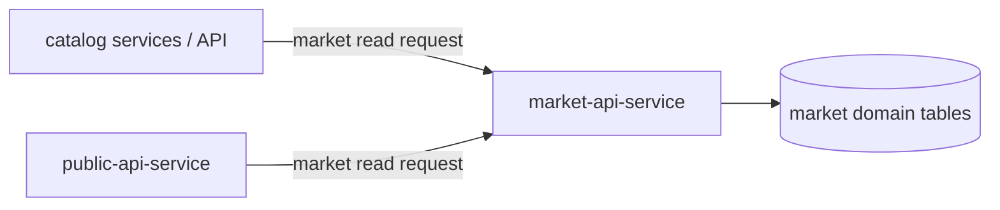

# Market API Service

`market-api-service` is the official API entrypoint into the market domain.
It exposes market read models to internal consumers and prevents direct
cross-domain coupling to market tables.

In architecture docs it is positioned as an internal read API used by other
services and by `public-api-service` during response aggregation.

---

## Responsibilities

The service:

- exposes read-only access to market pricing data
- provides access to market observations and MSRP-oriented views
- serves as cross-domain boundary for market data access
- supports aggregation flows in `public-api-service`
- encapsulates market schema behind stable API contracts

The service does not:

- run discovery or price collection jobs
- write market ingestion outcomes
- own scheduler-based source processing

---

## Boundary Role

`market-api-service` exists so that market data consumers do not rely on
internal market table structure directly.

---

## Ownership Rules Alignment

- market ingestion services (`market-release-discovery`, `market-price-collector`)
  write market data
- other domains read market data through `market-api-service`
- direct foreign-domain table access is intentionally avoided

This follows the platform-wide pattern documented in service-boundary and
data-ownership principles.

---

## Typical Consumers

| Consumer | Usage |
| --- | --- |
| `catalog-api-service` / catalog-facing flows | request price-related market information |
| `public-api-service` | aggregate market data for external-facing DTOs |
| other internal services | read-only market context through stable contracts |

---

## Boundaries

- domain role: market read boundary
- communication:
  - synchronous in: internal HTTP API requests
  - persistence read: market-domain tables
- no ingestion runtime ownership

---

## Related Services

| Service | Relationship |
| --- | --- |
| `market-release-discovery` | creates market links that eventually surface through market read models |
| `market-price-collector` | produces observations/MSRP data exposed by this API |
| `public-api-service` | consumes market API for external response assembly |
