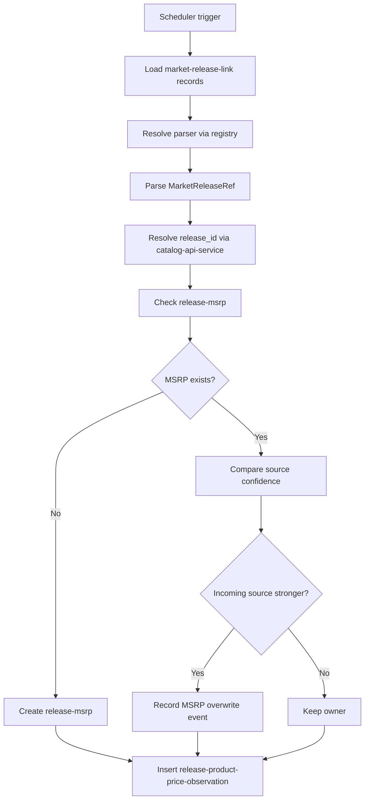

# Market Price Collector

`market-price-collector` is the recurring observation service in the market
domain. It processes known market links, parses current commercial state, links
observations to canonical releases, and writes historical price records.

---

## Responsibilities

The service:

- runs on scheduler by source/source-country context
- loads known `market-release-link` records
- resolves source adapters via `PortsRegistry`
- parses source state into a market DTO (e.g. `MarketReleaseRef`)
- resolves canonical `release_id` via `catalog-api-service` using `mpn`
- inserts append-only `release-product-price-observation` records
- creates `release-msrp` when missing
- compares source confidence and records MSRP overwrite events when stronger
  sources appear

The service does not:

- discover new market links (done by discovery service)
- create canonical releases in catalog domain
- expose public/read API endpoints

---

## Collection Flow

---

## Historical Storage Model

- append-only observations: each successful cycle inserts a new row
- unchanged prices are still recorded as new observations
- current state is derived from history, not from in-place overwrites

---

## Trust-Based MSRP Ownership

- MSRP source priority uses confidence value
- lower confidence value means stronger trust
- incoming stronger source can replace MSRP ownership with explicit overwrite
  event for auditability

---

## Boundaries

- domain role: market historical pricing and MSRP maintenance
- communication:
  - synchronous out: `catalog-api-service` for release identity resolution
  - persistence: market observation/MSRP tables
- cross-domain writes are not allowed; only API-based reads from catalog

---

## Related Services

| Service | Relationship |
| --- | --- |
| `market-release-discovery` | provides known link inventory consumed by collector |
| `catalog-api-service` | resolves canonical `release_id` from source `mpn` |
| `market-api-service` | serves collector-produced market data to other domains |
