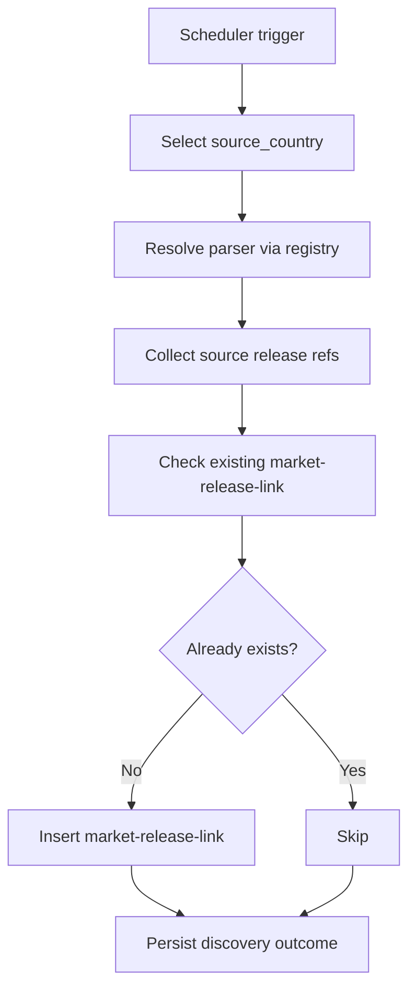

# Market Release Discovery

`market-release-discovery` is the discovery service of the market domain.
It scans official and retail sources, extracts release references, and creates
durable market links for entries not yet known to the platform.

---

## Responsibilities

The service:

- runs on scheduler per source/source-country context
- resolves source parser adapters via `PortsRegistry`
- collects source-specific `ReleaseRef` entries
- normalizes discovered source entries
- checks whether a `market-release-link` already exists
- creates missing `market-release-link` records
- skips already known entries

The service does not:

- collect recurring historical prices
- initialize or compare MSRP ownership
- resolve canonical release identity in catalog

---

## Discovery Flow

---

## Source Context Model

Discovery operates at `source_country` level, not only logical `source`.
This supports country-specific storefront differences in listing inventory and
commercial availability.

---

## Identity and Deduplication

For source-entry uniqueness, documentation references this key shape:

- `source_country_id`
- `external_id`

This allows the same logical source to be tracked separately across countries.

---

## Boundaries

- domain role: market source discovery and link inventory maintenance
- communication:
  - scheduler-triggered execution
  - persistence in market domain tables (primarily `market-release-link`)
- handoff to collector via durable discovered links in storage

---

## Related Services

| Service | Relationship |
| --- | --- |
| `market-price-collector` | consumes known links as recurring observation input |
| `catalog-api-service` | used downstream by collector, not by discovery |
| `market-api-service` | exposes read access to market outcomes, not used in discovery loop |
