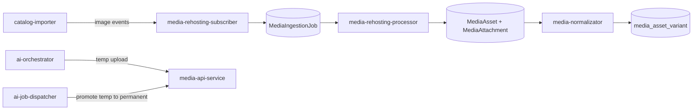

# Media Services Overview

The media domain converts external image references into canonical, reusable
platform assets and delivery-ready variants.

The workflow combines asynchronous intake, scheduler-driven processing, and a
shared media file API boundary.

---

## Service Map

| Service | Primary role |
| --- | --- |
| `media-rehosting-subscriber` | consumes Kafka media events and creates `MediaIngestionJob` records |
| `media-rehosting-processor` | downloads originals, deduplicates by hash, stores assets, creates attachments |
| `media-normalizator` | generates derived formats/sizes and optional AI-assisted variants |
| `media-api-service` | shared temp/permanent file lifecycle API with promotion and retrieval operations |

---

## High-Level Flow

---

## Ownership Boundaries

- subscriber owns intake-to-job conversion only
- processor owns original file ingest and canonical asset creation
- normalizator owns variant generation and media transformation lifecycle
- media-api-service owns storage abstraction and file lifecycle operations
  (temp zone, promotion, permanent access)

No non-media service should write media storage directly.

---

## Design Principles

1. asynchronous job creation decouples intake from heavy media processing
2. deduplication is hash-based (`sha256`) at canonical asset layer
3. variant generation is explicit via `MediaAssetVariant`, not implicit URLs
4. storage backend details remain behind `media-api-service`
5. cross-domain usage should go through API/service boundaries, not direct
   foreign-domain writes

---

## Related Service Pages

- [Media Rehosting Subscriber](./media-rehosting-subscriber.md)
- [Media Rehosting Processor](./media-rehosting-processor.md)
- [Media Normalizator](./media-normalizator.md)
- [Media API Service](./media-api-service.md)
- [Media Ingest Overview](../../pipelines/data-ingestion/media-ingest/overview.md)
