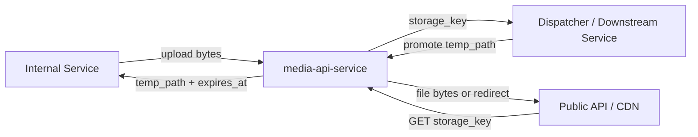
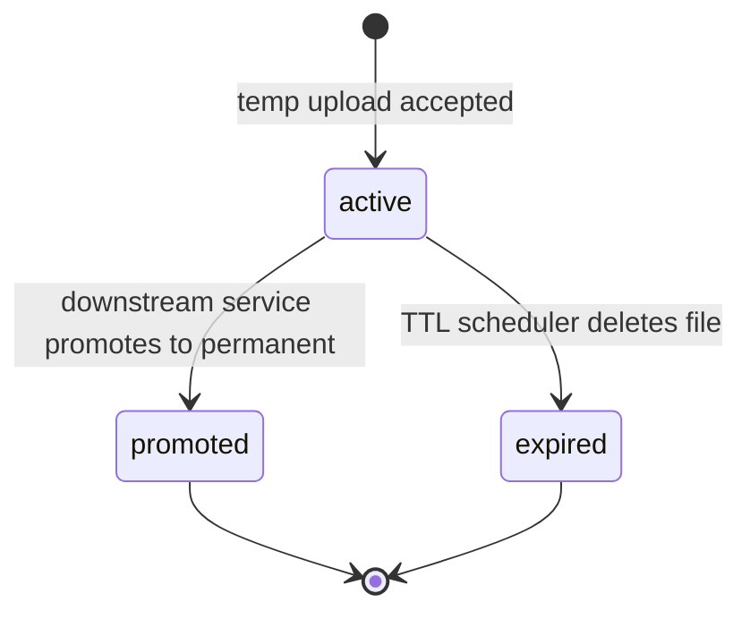
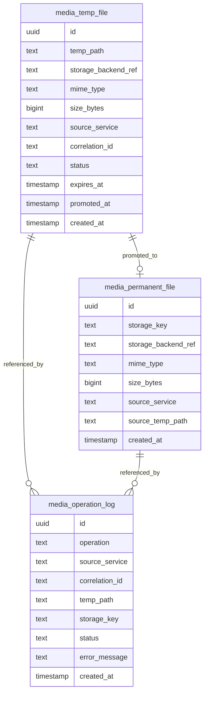
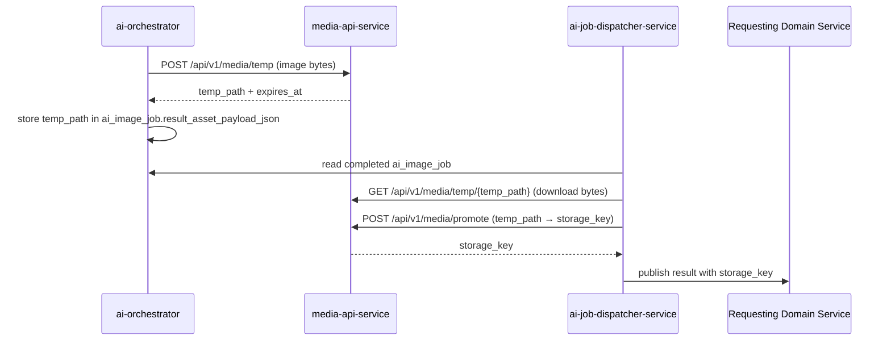

# Media API Service

`media-api-service` is a shared infrastructure service that manages the full
lifecycle of media files across the platform. It provides a single abstraction
over the underlying storage backend so that no other service writes to or reads
from storage directly.

The service exists to separate storage concerns from business logic. Services
that generate, ingest, or consume media files interact only with
`media-api-service` — they never touch MinIO, S3, or local disk directly.

---

## Responsibilities

The service:

- accepts temp file uploads from internal services
- returns a `temp_path` reference on successful upload
- serves temp files by `temp_path` for download
- promotes temp files to permanent storage on request
- returns a `storage_key` after promotion
- serves permanent files by `storage_key` or redirects to CDN
- enforces source service allowlist on all write operations
- applies TTL and cleans up expired temp files automatically
- records an audit log of all file operations

The service does not:

- generate or transform media content
- know the business meaning of the files it stores
- expose files to end users directly (that is the responsibility of the
  public API layer and CDN)

---

## Two Storage Zones



### Temp Zone

Short-lived files with a TTL. Used for intermediate results that have not yet
been confirmed as permanent — for example, an AI-generated image that is
awaiting dispatcher promotion.

- identified by `temp_path`: `temp/{source_service}/{job_id}/{filename}`
- default TTL: 2 hours (configurable per source service)
- automatically deleted by the cleanup scheduler after `expires_at`
- accessible by any allowlisted service within TTL

### Permanent Zone

Long-lived files with no automatic expiry. Used for confirmed, production-ready
media assets.

- identified by `storage_key`: `media/{domain}/{entity_id}/{filename}`
- created only via promotion from temp or direct ingest upload
- never automatically deleted

---

## File Lifecycle



---

## API Endpoints

### Temp zone

#### Upload temp file

```
POST /api/v1/media/temp
Content-Type: multipart/form-data

Fields:
  file         — binary content
  mime_type    — e.g. image/webp
  source_service — caller identity for audit and allowlist check
  correlation_id — optional, propagated from upstream event
```

Response `201 Created`:

```json
{
  "temp_path": "temp/ai-orchestrator/job-uuid/front.webp",
  "expires_at": "2026-03-15T20:00:00Z",
  "size_bytes": 204800,
  "mime_type": "image/webp"
}
```

#### Download temp file

```
GET /api/v1/media/temp/{temp_path}
```

Returns raw file bytes with appropriate `Content-Type` header.
Returns `404` if file is expired or does not exist.

#### Get temp file metadata

```
GET /api/v1/media/temp/{temp_path}/info
```

Response `200 OK`:

```json
{
  "temp_path": "temp/ai-orchestrator/job-uuid/front.webp",
  "status": "active",
  "mime_type": "image/webp",
  "size_bytes": 204800,
  "expires_at": "2026-03-15T20:00:00Z",
  "created_at": "2026-03-15T18:00:00Z"
}
```

---

### Permanent zone

#### Promote temp file to permanent

```
POST /api/v1/media/promote
Content-Type: application/json

{
  "temp_path": "temp/ai-orchestrator/job-uuid/front.webp",
  "storage_key": "media/catalog/release-123/front.webp",
  "source_service": "ai-job-dispatcher-service"
}
```

`storage_key` is provided by the caller — the caller controls where the file
lives in permanent storage. `media-api-service` validates that the key does not
conflict with an existing permanent file.

Response `200 OK`:

```json
{
  "storage_key": "media/catalog/release-123/front.webp",
  "promoted_at": "2026-03-15T18:05:00Z",
  "size_bytes": 204800,
  "mime_type": "image/webp"
}
```

#### Get permanent file or redirect

```
GET /api/v1/media/{storage_key}
```

Returns file bytes directly (internal use) or a redirect to CDN URL
(public-facing use). Behavior is determined by the `Accept` header or a
query parameter.

#### Get permanent file metadata

```
GET /api/v1/media/{storage_key}/info
```

Response `200 OK`:

```json
{
  "storage_key": "media/catalog/release-123/front.webp",
  "mime_type": "image/webp",
  "size_bytes": 204800,
  "source_temp_path": "temp/ai-orchestrator/job-uuid/front.webp",
  "created_at": "2026-03-15T18:05:00Z"
}
```

---

## Database Schema

> All tables reside in the `media` schema.



### `media_temp_file.status`

| Value | Meaning |
| --- | --- |
| `active` | file is available for download and promotion |
| `promoted` | file has been moved to permanent storage |
| `expired` | TTL exceeded, file deleted from storage backend |

### `media_operation_log.operation`

| Value | Meaning |
| --- | --- |
| `temp_upload` | file uploaded to temp zone |
| `temp_download` | file downloaded from temp zone |
| `promote` | temp file promoted to permanent |
| `permanent_download` | permanent file served or redirected |
| `temp_expired` | file deleted by TTL scheduler |

---

## Temp File Cleanup Scheduler

A scheduler runs within `media-api-service` at a configurable interval
(default: every 5 minutes). It finds all `active` temp files where
`expires_at < now()`, deletes the underlying bytes from the storage backend,
and marks the row as `expired`.

```sql
SELECT * FROM media_temp_file
WHERE status = 'active'
  AND expires_at < now();
```

For each row: delete from storage backend, then update `status = 'expired'`
in the same logical unit. The operation is logged to `media_operation_log`.

Promoted files are never deleted by the scheduler regardless of their original
`expires_at`.

---

## Source Service Allowlist

Only known internal services may upload files. The allowlist is managed via
service configuration. Unknown callers receive `403 Forbidden`.

Write operations (upload, promote) are restricted to allowlisted services.
Read operations (download, info) are available to any internal service.

---

## How It Fits With AI Pipeline



The orchestrator only uploads to temp. It never promotes or assigns permanent
storage keys. That decision belongs to `ai-job-dispatcher-service`, which
knows the target domain and the correct `storage_key` naming convention.

---

## Error Handling

| Scenario | Behavior |
| --- | --- |
| Upload exceeds max file size | `413 Payload Too Large` |
| Unknown `source_service` | `403 Forbidden` |
| `temp_path` not found or expired | `404 Not Found` |
| `storage_key` already exists on promote | `409 Conflict` |
| Storage backend unavailable | `503 Service Unavailable`, caller retries |
| Scheduler cleanup failure | logged to `media_operation_log`, retried next cycle |

---

## Ownership Boundaries

| Component | Responsibility |
| --- | --- |
| `media-api-service` | manages temp and permanent file lifecycle |
| `media-api-service` | abstracts storage backend from all other services |
| `media-api-service` | enforces upload allowlist |
| `media-api-service` | runs TTL cleanup scheduler |
| `ai-orchestrator` | uploads generated image bytes to temp zone |
| `ai-job-dispatcher-service` | promotes temp image to permanent zone |
| Public API / CDN layer | serves permanent files to end users |

---

## Key Design Principles

1. **No service writes to storage directly — all access goes through
   `media-api-service`**
2. **Temp and permanent zones are strictly separated — promotion is an
   explicit operation**
3. **The caller controls `storage_key` naming — `media-api-service` does not
   invent paths**
4. **TTL cleanup is automatic — callers do not need to manage temp file
   deletion**
5. **All operations are audit-logged — `media_operation_log` is the source
   of truth for what happened to a file**
6. **Storage backend is an implementation detail — switching from local disk
   to MinIO to S3 requires no changes outside `media-api-service`**
