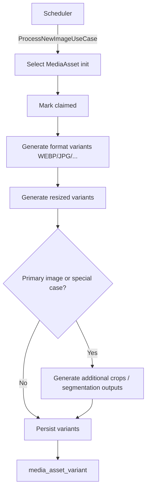

# Media Normalizator

`media-normalizator` is the third stage of the media ingest pipeline.
It takes canonical stored assets and produces delivery-ready variants.

In some pipeline diagrams this stage is named `media-normalization`. The
responsibility is the same: normalize and derive variants from original assets.

---

## Responsibilities

The service:

- is triggered by scheduler-based processing
- selects `MediaAsset` records with `processing_state = init`
- claims assets for processing (`claimed`)
- generates derived formats (for example `WEBP`, `JPG`, and platform-defined
  variants such as PNG where configured)
- produces multiple size variants for responsive delivery
- creates `media_asset_variant` records for every generated output
- may create additional crops for primary entity images
- may run segmentation-oriented derivations for multi-object source images

The service also coordinates optional AI-assisted operations through
the AI pipeline via Kafka (`ai.job.requested` / result topic).

The service does not:

- ingest external URLs directly (handled by rehosting stages)
- own AI workflow execution runtime (owned by `ai-orchestrator`)
- directly expose assets to public clients

---

## Trigger and Output

| Input | Trigger | Output |
| --- | --- | --- |
| `MediaAsset` (`processing_state = init`) | scheduler invokes `ProcessNewImageUseCase` | `media_asset_variant` records (format, size, AI-derived) |

---

## Processing Flow

---

## AI-Assisted Processing Integration

When AI operations are needed, `media-normalizator`:

1. publishes `ai.job.requested` to Kafka with `job_type: "image"`
2. `ai-intake-service` creates `ai_job` + `ai_image_job` records
3. `ai-orchestrator` claims and executes the image scenario
4. `ai-job-dispatcher-service` promotes the result and publishes it back via `result_route_key`
5. reads the Kafka result and applies it to media variant generation

Typical AI-assisted use cases:

- background cleanup/removal
- quality enhancement
- object extraction from one source image into multiple outputs

`ai-orchestrator` logs AI calls and writes execution results, while
`media-normalizator` remains the owner of media asset/variant persistence.

---

## Data Produced

Primary output model: `MediaAssetVariant`

Typical fields include:

- `asset_id`
- `variant_name`
- `transform`
- storage coordinates
- content metadata (dimensions, MIME, hash)
- `status` (`active`, `generating`, `failed`)

All variants stay linked to one canonical asset.

---

## State and Operational Model

- Work is scheduler-driven, not request-driven
- Assets are claimed before heavy processing to avoid duplicate workers
- Variants are persisted with explicit status and error context
- Operational observability depends on processing-state distribution and
  retry/failure tracking

---

## Dependencies

| Dependency | Purpose |
| --- | --- |
| Scheduler | drives normalization job execution |
| PostgreSQL (`media` schema) | reads assets, writes `media_asset_variant` |
| Object storage (MinIO/S3) | stores generated derivatives |
| AI pipeline (Kafka) | optional AI-based transformations |
| `monstrino-contracts` (`media_normalization`) | shared contracts |

---

## Boundary and Ownership

- Domain: **media**
- Internal only: no direct public API exposure
- Cross-domain principle: media domain owns asset and variant lifecycle
- AI boundary: this service requests AI work but does not execute AI runtime

---

## Related Services

| Service | Relationship |
| --- | --- |
| `media-rehosting-processor` | provides canonical source assets |
| `ai-orchestrator` | executes optional AI jobs and returns results |
| `media-api-service` | serves media lifecycle operations in the shared media domain |
