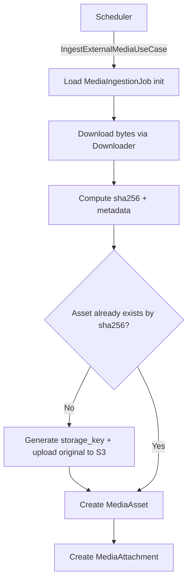

# Media Rehosting Processor

`media-rehosting-processor` is the second stage of the media ingest pipeline.
It takes durable ingestion jobs and turns them into canonical media assets.

This service is responsible for external download, checksum-based deduplication,
original-file storage, and attachment creation.

---

## Responsibilities

The service:

- is triggered by scheduler (not by direct event handling)
- loads `MediaIngestionJob` records with `processing_state = init`
- downloads image bytes from external URLs through internal `Downloader`
- computes and uses `sha256` hash for deduplication
- uploads original files to S3-compatible storage through `S3Storage`
- creates canonical `MediaAsset` records
- creates `MediaAttachment` records with ownership context

The service does not:

- produce delivery variants (format/size/AI-derived)
- mutate foreign-domain tables directly
- serve public image traffic

---

## Trigger and Output

| Input | Trigger | Output |
| --- | --- | --- |
| `MediaIngestionJob` (`processing_state = init`) | scheduler invokes `IngestExternalMediaUseCase` | `MediaAsset` + `MediaAttachment` + stored original file |

---

## Processing Flow



---

## Download Contract

The processor uses an internal download result model:

```python
class DownloadedFile:
    content: bytes
    sha256_hex: str
    content_type: str
    byte_size: int
    width: Optional[int]
    height: Optional[int]
    original_filename: Optional[str]
    ext: Optional[str]
    image_format: Optional[str]
```

This metadata is used for deduplication, storage, and asset metadata fields.

---

## Data Produced

### MediaAsset

Canonical stored image record with storage coordinates and content metadata.

### MediaAttachment

Ownership mapping that links an asset to domain entities (for example:
`release`, `character`, `pet`) using fields such as:

- `owner_service`
- `owner_type`
- `owner_id`
- `owner_ref`

---

## State and Idempotency

- Source work model: `MediaIngestionJob`
- Typical progression: `init` -> `claimed` -> `completed` (or retry/failure)
- Deduplication key: content hash (`sha256`)
- Idempotency expectation: repeated jobs for identical content should reuse the
  same canonical asset when possible

---

## Dependencies

| Dependency | Purpose |
| --- | --- |
| Kafka (indirect) | receives work created by subscriber stage |
| Scheduler | claims and runs rehosting jobs |
| Object storage (MinIO/S3) | stores original downloaded files |
| PostgreSQL (`media` schema) | persists jobs, assets, attachments |
| `monstrino-contracts` (`media_rehosting_processor`) | shared contracts |

---

## Boundary and Ownership

- Domain: **media**
- Internal only: not public-facing
- Communication style: database-driven scheduled processing
- Cross-domain rule: ownership context is written into attachment metadata; no
  direct writes into non-media domain schemas

---

## Related Services

| Service | Relationship |
| --- | --- |
| `media-rehosting-subscriber` | creates `MediaIngestionJob` input records |
| `media-normalizator` | consumes produced assets for variant generation |
| `catalog-api-service` | used by media domain when cross-domain catalog data is needed |
