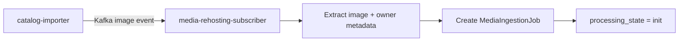

# Media Rehosting Subscriber

`media-rehosting-subscriber` is the first stage of the media ingest pipeline.
It does not download or transform images. Its only responsibility is to
translate upstream media events into durable work units.

The service subscribes to Kafka events produced by catalog ingestion and
persists `MediaIngestionJob` rows with an initial processing state.

---

## Responsibilities

The service:

- subscribes to Kafka image events (emitted by `catalog-importer`)
- extracts media URL and ownership context from the event payload
- creates a `MediaIngestionJob` record
- sets `processing_state = init` for downstream scheduler processing
- preserves idempotency through job-level identity fields

The service does not:

- download external files
- upload files to object storage
- create `MediaAsset`, `MediaAttachment`, or variants
- perform normalization or AI-based transformations

---

## Trigger and Output

| Input | Trigger | Output |
| --- | --- | --- |
| Kafka image event from catalog ingest | Kafka subscription | persisted `MediaIngestionJob` (`processing_state = init`) |

---

## Processing Flow

---

## Data It Writes

The service writes `MediaIngestionJob` records in the media domain.

Typical job-level fields used by downstream stages include:

- source: `source_url`, source metadata
- ownership target: `owner_service`, `owner_type`, `owner_id`, `role`,
  `sort_order`
- lifecycle: `processing_state`, retry/lease fields
- idempotency: `idempotency_key`

The scheduler-driven processor stage consumes these records.

---

## Boundary and Ownership

- Domain: **media**
- Internal only: not exposed as a public API
- Communication style: **asynchronous** (Kafka in), **database handoff** out
- Ownership rule: writes only media-owned operational data

---

## Related Services

| Service | Relationship |
| --- | --- |
| `catalog-importer` | publishes source image events |
| `media-rehosting-processor` | consumes created `MediaIngestionJob` records |
| `media-normalizator` | processes assets after rehosting stage completion |

---

## Design Notes

1. This service is the ingestion buffer between catalog and media pipelines.
2. Durable job creation decouples event intake from heavy image work.
3. Kafka participation is intentionally limited to internal pipeline services.
