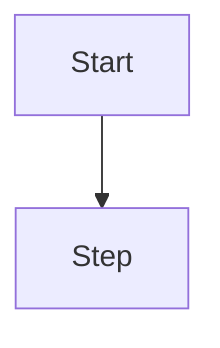

:::info
<ResolverName> is responsible for <short description>.
:::

## Purpose
Describe the purpose of the resolver.

## Context and Dependencies

### Depends on
- <dependency>
- <dependency>

## Input specification

### Method signature
```python
<method signature>
```

### Params
| Name | Type | Description |
|------|------|-------------|
| `<param>` | `<type>` | `<description>` |

### Expected input
```json
<example>
```

### Validation rules
- rule 1
- rule 2

## Execution Flow
1. step
2. step

### Mermaid diagram


## Error Handling
Describe errors.

## Logging
Describe logs.

## Example usage
```python
<example>
```

## What to Test
- case 1
- case 2

## Future Extensions
List TODOs.