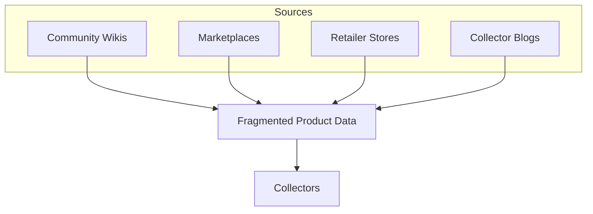
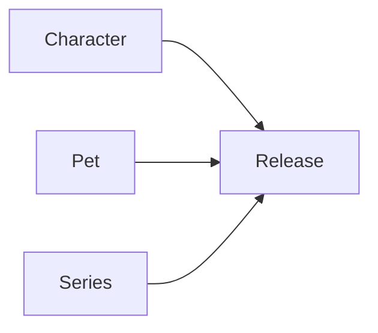

# Problem Space

:::info TL;DR
Collector data for franchises like Monster High is
**scattered, unstructured, and incomplete** across dozens of websites.
Monstrino fixes this by building one canonical, structured catalog.
:::

---

## The Core Issue

> Finding complete information about a single doll release requires
> visiting **multiple websites**, reading **long unstructured descriptions**,
> and manually reconciling **inconsistent data**.

---

## Five Problems We're Solving

### 🗂️ 1. Fragmented Product Information

The same product exists across many sources —
each with different, partial, or conflicting data:

| Source         | Title                   | MPN   | Accessories         |
| -------------- | ----------------------- | ----- | ------------------- |
| Community Wiki | Draculaura Doll         | —     | described in text   |
| Amazon         | Draculaura Fashion Doll | HKY70 | not listed          |
| eBay           | MH Draculaura 2022      | HKY70 | unknown             |
| Collector Blog | Draculaura Review       | —     | partially described |

Collectors must manually combine all of these to understand a single release.



---

### 📄 2. Unstructured Catalog Data

Product details are buried inside prose, not structured fields.

**Typical product description:**

```text
Includes a brush, purse and a diary accessory.
```

**What it should look like:**

```yaml
accessories:
  - brush
  - purse
  - diary
```

Without structured data, you can't compare releases, analyze contents,
or build reliable catalog systems.

---

### 📦 3. Missing Package Contents

Collectors regularly ask:

- Which accessories were in the original box?
- Did the doll include a pet?
- Which clothing items belong to this release?

This information almost never exists in structured catalogs —
it's scattered across YouTube reviews, blog posts, and forum threads.
This makes it impossible to verify if a listing is complete.

---

### 💰 4. No Aggregated Market Pricing

Real market value requires checking multiple platforms simultaneously:

| Platform               | Coverage         |
| ---------------------- | ---------------- |
| Official retailers     | MSRP only        |
| eBay                   | Secondary market |
| Vinted                 | Pre-owned        |
| Collector marketplaces | Niche pricing    |

Each platform shows only a slice of the market.
A proper catalog should aggregate all of them.

---

### 🕸️ 5. No Franchise Knowledge Graph

Each release is treated as an isolated entry —
but collectible franchises have rich relationships:



Collectors want to explore: *Which releases belong to this character?
Which pets? How did this character evolve across generations?*
No existing catalog supports this.

---

## Summary

| Problem                | Impact                                |
| ---------------------- | ------------------------------------- |
| Fragmented sources     | Manual cross-referencing required     |
| Unstructured data      | Can't compare or automate             |
| Missing contents       | Can't verify listing completeness     |
| No pricing aggregation | Hard to estimate real market value    |
| No knowledge graph     | Can't explore franchise relationships |

**Monstrino** addresses all five by building a canonical catalog
through automated data ingestion, enrichment, and normalization pipelines.
