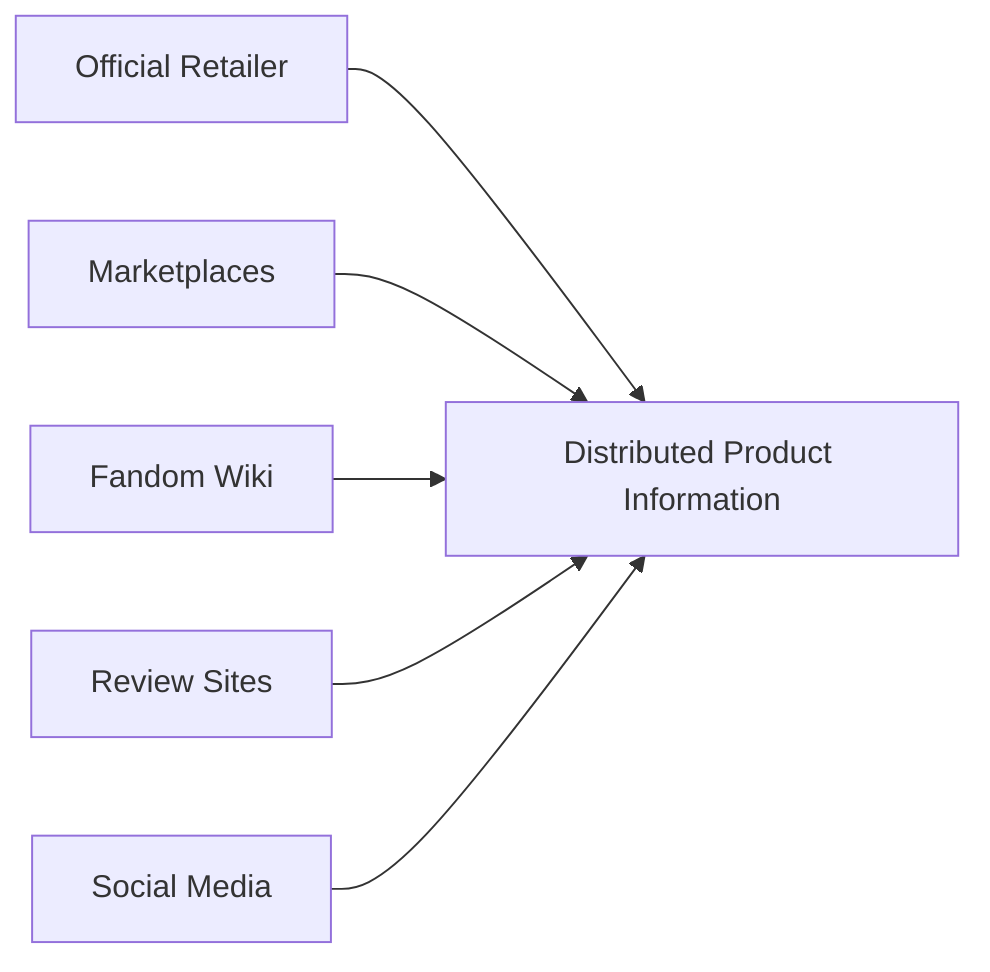
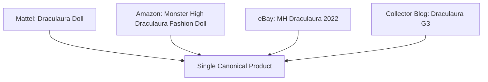
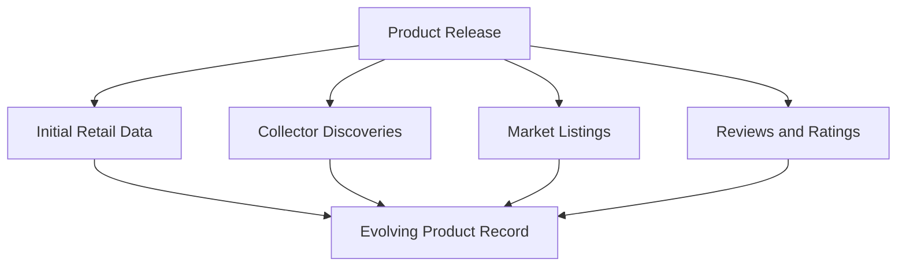
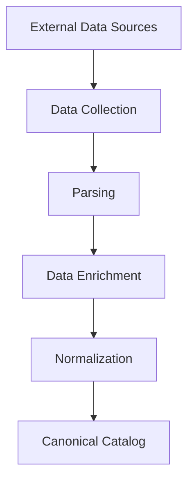

# Catalog Data Reality

:::warning Key Fact
Product catalog data is **never** clean, complete, or consistent.
:::

A platform like Monstrino exists not because displaying products is difficult,
but because **catalog data itself is inherently complex**.

---

## Four Properties of Real-World Catalog Data

### 🌐 1. Distributed

Product information rarely comes from one authoritative source.
It is spread across many independent platforms —
each containing only a **fragment** of the complete picture:

| Source          | Information Available                       |
| --------------- | ------------------------------------------- |
| Mattel Store    | official title, product photos, description |
| Amazon          | official market prices                      |
| eBay listings   | secondary market prices                     |
| Fandom Wiki     | description and release lore                |

---

### ⚠️ 2. Inconsistent

The same product appears with different titles, IDs, and descriptions
across different platforms:

| Source          | Title                                |
| --------------- | ------------------------------------ |
| Mattel          | Draculaura Doll                      |
| Amazon          | Monster High Draculaura Fashion Doll |
| eBay            | MH Draculaura 2022                   |
| Collector blog  | Draculaura G3 release                |

All four rows describe the **same product entity**.
Resolving these requires entity matching and normalization.

---

### 🧩 3. Incomplete

Even official sources provide only partial data.
No single source contains everything:

| Attribute     | Official Store | Wiki | Review |
| ------------- | -------------- | ---- | ------ |
| Title         | ✔              | ✔    | ✔      |
| MPN           | ✔              | ✖    | ✖      |
| Accessories   | ✖              | ✔    | ✔      |
| Box contents  | ✖              | ✖    | ✔      |
| Release lore  | ✖              | ✔    | ✔      |

Reliable catalogs must **combine multiple sources and enrich missing fields**.

---

### 🔄 4. Evolving Over Time

Product information is not static.
New data appears gradually after a release:

- collectors discover additional accessories
- new product photos surface
- market prices change
- reviews and ratings accumulate

Catalog data must be **continuously updated and enriched**.

---

## Why This Requires Automated Pipelines

Manual catalog maintenance does not scale.
Automated pipelines are needed to:

- collect data from multiple sources
- parse heterogeneous content formats
- resolve entity conflicts
- enrich missing attributes
- normalize data into a canonical model

---

## Summary

| Property              | Consequence                               |
| --------------------- | ----------------------------------------- |
| Distributed           | No single source of truth                 |
| Inconsistent          | Same product has many representations     |
| Incomplete            | Attributes must be merged across sources  |
| Evolves over time     | Catalog requires continuous re-ingestion  |

**Monstrino** addresses these challenges through automated
**data ingestion, enrichment, and normalization pipelines**,
constructing a canonical catalog from fragmented ecosystem data.
