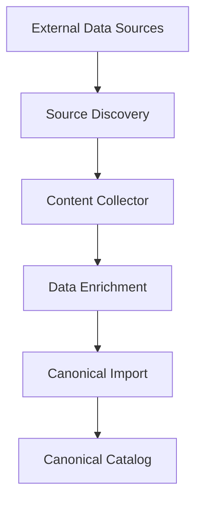
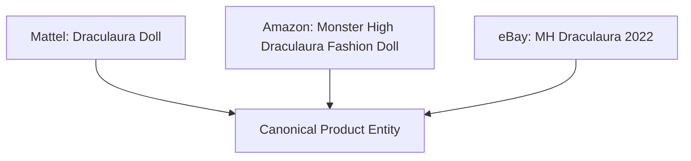
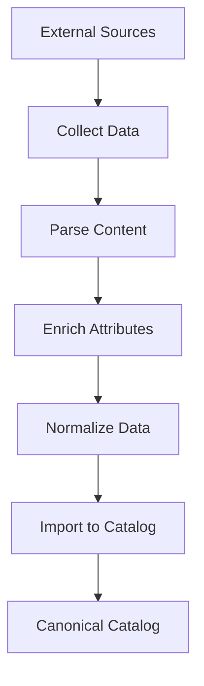
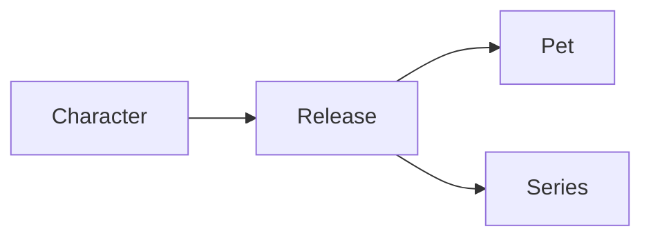

# Monstrino Approach

:::info Core Idea
Monstrino treats collectible catalogs as a **data ingestion and
normalization problem** — not as a manually curated database.
:::

Collectible data is fragmented, inconsistent, and constantly evolving.
Manual catalog maintenance doesn't scale.
Monstrino solves this by operating as a **data ingestion platform**
that continuously collects, enriches, and normalizes external data.

---

## Platform Architecture Overview

| Stage               | Purpose                                         |
| ------------------- | ----------------------------------------------- |
| Source discovery    | Identify new data sources and releases          |
| Content collection  | Retrieve raw product information                |
| Data enrichment     | Extract additional attributes and metadata      |
| Canonical import    | Transform data into the canonical catalog model |

---

## Canonical Catalog Model

External sources describe the same product in different ways.
Monstrino separates **source data** from **canonical entities**.

| Source       | Title                                |
| ------------ | ------------------------------------ |
| Mattel Store | Draculaura Doll                      |
| Amazon       | Monster High Draculaura Fashion Doll |
| eBay         | MH Draculaura 2022                   |

All three rows are the **same underlying product**.

---

## Pipeline Stages in Detail

**🔍 Collection** — retrieves product pages from retailers,
marketplaces, wikis, and collector databases.

**📐 Parsing** — converts raw content into structured data models.

**✨ Enrichment** — extracts and infers additional attributes
from descriptions, images, community sources, and AI analysis.

**🔧 Normalization** — transforms everything into a consistent
canonical structure.

**📥 Import** — stores the normalized entity in the canonical catalog.

---

## Franchise Knowledge Graph

Unlike simple catalog websites, Monstrino represents the franchise
as a connected data graph — enabling exploration no traditional
catalog supports:

- all releases belonging to a character
- pets associated with specific characters
- releases grouped by series or generation

---

## How It Addresses Each Problem

| Ecosystem Problem              | Monstrino Solution                      |
| ------------------------------ | --------------------------------------- |
| Fragmented sources             | Automated ingestion pipelines           |
| Inconsistent product names     | Normalization into canonical entities   |
| Incomplete metadata            | Enrichment from multiple sources        |
| Evolving information           | Continuous pipeline updates             |

---

## Summary

Monstrino is a **data platform** that:

- ingests data from multiple heterogeneous sources
- enriches incomplete product attributes
- normalizes inconsistent information
- constructs a canonical, relationship-aware catalog model

The result: fragmented ecosystem data becomes a structured,
continuously evolving collectible catalog.
